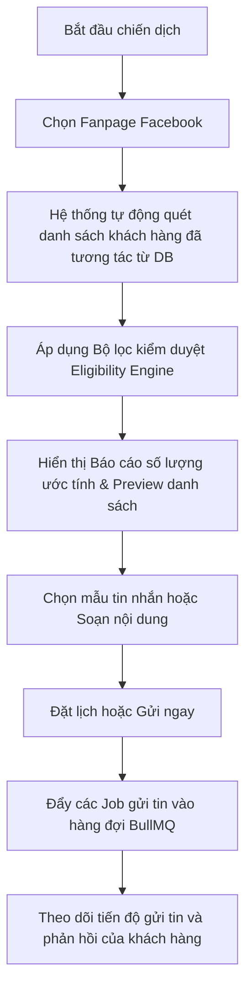

# TÀI LIỆU ĐẶC TẢ NGHIỆP VỤ HỆ THỐNG - PHẦN 7: TÍNH NĂNG GỬI TIN NHẮN MESSENGER HÀNG LOẠT CHO KHÁCH HÀNG ĐÃ TƯƠNG TÁC
*Biên soạn bởi: Senior Business Analyst (10 năm kinh nghiệm)*
*Dự án: Nền tảng Marketing & Chăm sóc khách hàng tự động cho Spa (MarketingAutoAZ)*

---

## 1. Tổng quan Tính năng
Tính năng **Gửi tin nhắn Messenger hàng loạt cho khách hàng đã tương tác** cho phép chủ Spa/nhân viên tiếp thị tạo một chiến dịch tin nhắn (Broadcast) và hệ thống sẽ tự động quét, truy vấn danh sách toàn bộ những khách hàng trước đây đã từng nhắn tin/gửi tin nhắn tương tác với Fanpage Facebook được chọn.

Hệ thống tự động sử dụng nguồn dữ liệu có sẵn trong cơ sở dữ liệu (`MessagingContactIdentity` của kênh `MESSENGER`), khớp với Fanpage Facebook được chọn theo mã định danh `channelConnectionId`, do đó **không yêu cầu người dùng phải tự tải lên tệp tin Excel/CSV bên ngoài**.

---

## 2. Quy trình Luồng Nghiệp vụ (User Flow)

### Bước 1: Thiết lập cấu hình Chiến dịch
- Người dùng tạo mới chiến dịch gửi tin nhắn hàng loạt (`campaignType = BROADCAST`, `channel = MESSENGER`).
- Chọn Fanpage cụ thể muốn gửi tin từ danh sách liên kết (`channelConnectionId`).

### Bước 2: Tự động phân giải danh sách người nhận (Automatic Resolution)
Hệ thống tự động thực hiện truy vấn cơ sở dữ liệu để tìm tất cả các hồ sơ danh tính (`MessagingContactIdentity`) thỏa mãn các điều kiện:
1.  **Thuộc cùng tổ chức** (`organizationId`).
2.  **Có kênh hoạt động là Facebook Messenger** (`channel = MESSENGER`).
3.  **Tương tác qua Fanpage đã chọn**: Khớp trường `integrationScopeKey` với cấu hình của Fanpage (`messenger:page_id`).
4.  **Bản ghi gốc**: Chỉ lấy các danh tính chính, bỏ qua các bản ghi đã gộp (`mergedIntoId IS NULL`).

### Bước 3: Áp dụng Bộ lọc kiểm duyệt (Eligibility & Spam check)
Danh sách khách hàng sau khi tự động quét được chuyển qua **Eligibility Engine** kiểm duyệt:
- Loại bỏ các khách hàng đã từ chối nhận tin nhắn (`optedOut = true` hoặc `isBlocked = true`).
- **Kiểm soát cửa sổ 24 giờ**: Phân loại danh sách:
  - *Nhóm trong 24 giờ*: Gửi tin nhắn chăm sóc khách hàng thông thường không cần nhãn.
  - *Nhóm ngoài 24 giờ*: Bắt buộc phải gắn nhãn (Message Tags) theo quy chuẩn Meta (ví dụ: `CONFIRMED_EVENT_UPDATE` cho lịch hẹn, `POST_PURCHASE_UPDATE` cho cập nhật đơn hàng). Nếu chiến dịch không cấu hình thẻ tag phù hợp, hệ thống tự động bỏ qua nhóm ngoài 24h này để bảo vệ Fanpage tránh bị Meta khóa.
- Báo cáo số lượng xem trước (Preview): Tổng số khách hàng đã từng nhắn, số lượng đủ điều kiện gửi ngay, số lượng bị loại trừ.

### Bước 4: Soạn thảo cá nhân hóa và Gửi tin
- Sử dụng mẫu tin nhắn (`MessageTemplate`) hoặc soạn thảo văn bản tự do, chèn các biến động có sẵn trong CRM như `{{customer_name}}` để tự động cá nhân hóa tên khách hàng.
- Nhấn "Gửi ngay" hoặc "Đặt lịch". Hệ thống đưa các lượt gửi vào queue `MESSAGING_SEND` của BullMQ xử lý với cơ chế rate limiting và khóa chống trùng lặp `Idempotency Key` dựa trên `campaignId` và `identityId`.

---

## 3. Cấu trúc Mô hình Dữ liệu liên quan (Database Schema Mapping)

Tính năng này sử dụng cấu trúc cơ sở dữ liệu hiện tại để tối ưu hóa hiệu năng và đảm bảo độ ổn định cao nhất:

- **Chiến dịch (`MessagingCampaign`)**:
  - `channelConnectionId`: Liên kết tới Fanpage gửi tin.
  - `segmentConfig`: Lưu cấu hình phân khúc bộ lọc (ví dụ: các tùy chọn kiểm duyệt bổ sung như chỉ gửi cho khách hàng VIP, khách hàng đã lâu chưa tương tác, v.v.).
- **Người nhận (`MessagingCampaignRecipient`)**:
  - `identityId`: Liên kết trực tiếp tới `MessagingContactIdentity` của khách hàng được quét tự động.
  - `idempotencyKey`: Mã chống gửi trùng lặp độc bản `hash(campaignId + identityId)`.
  - `status`: Quản lý tiến trình gửi tin từ `PENDING` -> `QUEUED` -> `SENT` / `FAILED`.

---

## 4. Các Quy tắc Nghiệp vụ Đặc thù (Business Rules)

1.  **Giới hạn điều phối (Rate Limiting)**:
    - Việc gửi tin nhắn Messenger hàng loạt phải tuân thủ giới hạn tần suất gọi API của Meta (Meta API Rate Limit). Worker xử lý queue sẽ chia nhỏ và gửi tin nhắn giãn cách để duy trì trạng thái hoạt động tự nhiên của Fanpage.
2.  **Tự động bàn giao hội thoại (Chatbot Handover)**:
    - Nếu khách hàng phản hồi lại tin nhắn hàng loạt này, hệ thống sẽ tạm dừng Chatbot CSKH tự động đối với cuộc hội thoại đó (`chatbotConversation.status = INACTIVE`) và đẩy thông báo khẩn để nhân viên vào khung chat CRM tiếp quản trao đổi thủ công.
3.  **Bảo mật dữ liệu (Privacy Control)**:
    - Màn hình quản lý chiến dịch chỉ hiển thị tên khách hàng và thông tin chung, mã định danh Facebook PSID được ẩn/mã hóa khi hiển thị công khai trên giao diện để tránh rò rỉ dữ liệu.
